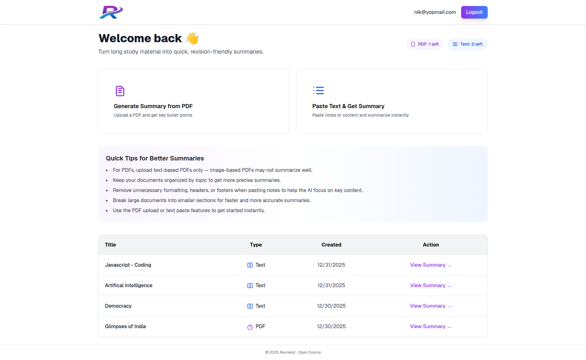
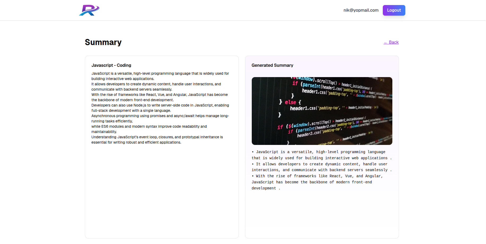

# Reviselyt
Reviselyt is an open-source learning tool built with Next.js, Supabase, and AI APIs to help students summarize long study material into concise bullet points.

Built for students, exam preparation, and interview revision.

---
If you find this project useful, please consider starring the repository.

<p align="center">
    
</p>

<p align="center">
    
</p>

## Features

- Upload PDF files or paste plain text
- AI-generated 5–10 bullet summaries
- Daily free usage limits (Free Tier)
  - 1 PDF summary per day
  - 2 Text summaries per day
- Clean and distraction-free UI
- Secure authentication and storage
- All summaries saved for later revision

---

## Tech Stack

- Next.js (App Router)
- Typescript
- Tailwind CSS
- Supabase (Auth + Database)
- Hugging Face (AI models)
- Pixabay API (visual assets)

---

## Free Tier Limits

| Feature | Limit |
|------|------|
| PDF Summaries | 1 per day |
| Text Summaries | 2 per day |

Limits reset automatically every day.

---

## Local Development Setup

### 1. Clone the repository

```bash
git clone https://github.com/your-username/reviselyt.git
cd reviselyt
```


### 2. Install dependencies


Using npm

```bash
npm install
```

Or using yarn:

```bash
yarn install
```

### 3. Environment Variables

Create a .env.local file using the example below.
```bash
cp .env.example .env.local
```

Fill in your own values.

```bash
NEXT_PUBLIC_SUPABASE_URL=
NEXT_PUBLIC_SUPABASE_PUBLISHABLE_KEY=
HF_API_TOKEN=
PIXABAY_API_KEY=
```

### 4. Run the project locally
```bash
npm run dev
```
or
```bash
yarn dev
```

Visit:
```bash
http://localhost:3000
```
### Open Source

Reviselyt is built in public and open source.
Issues, feature requests, and pull requests are welcome.

### License

Reviselyt is licensed under the **GNU Affero General Public License v3.0 (AGPL-3.0)**.

This means:
- You are free to use, study, and modify the code.
- If you deploy this project as a web service or SaaS, you **must make your source code public**.
- You are **not allowed to take this project, modify it, and sell it as a closed-source product**.

See the [LICENSE](./LICENSE) file for full details.
