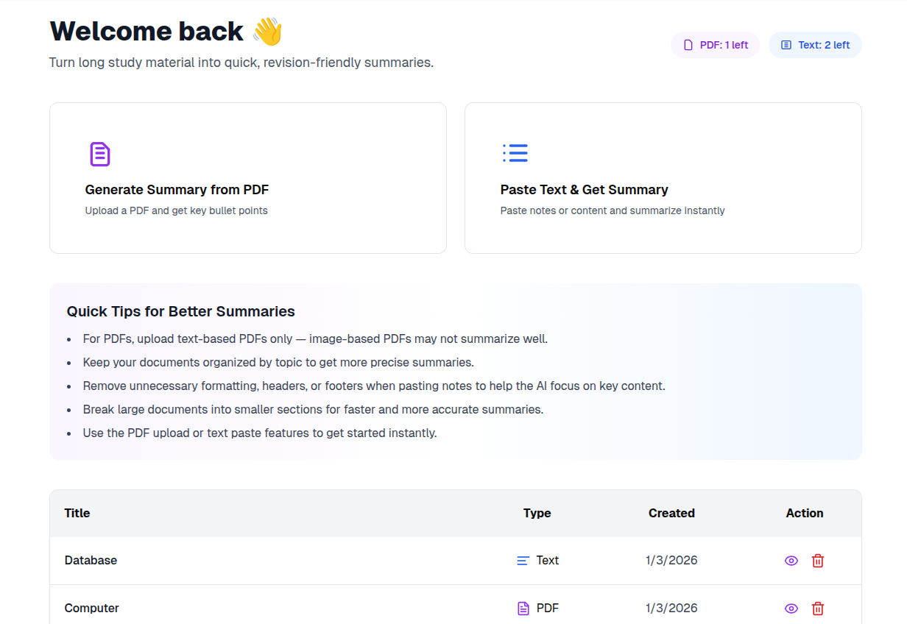
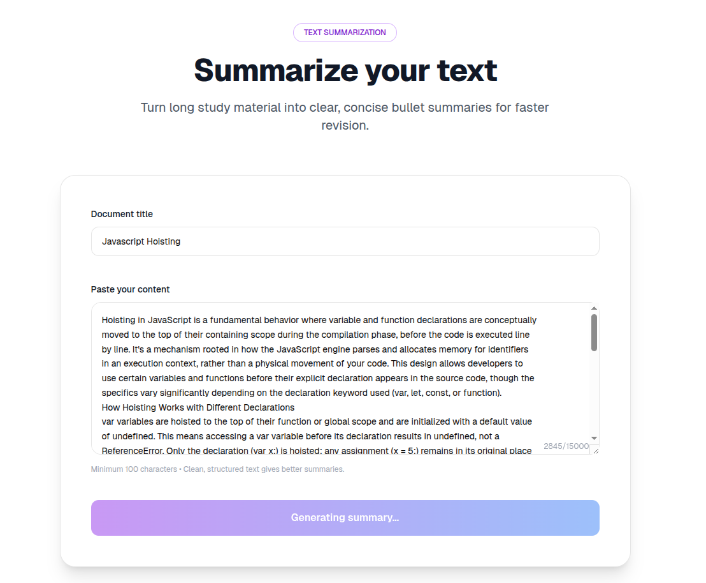
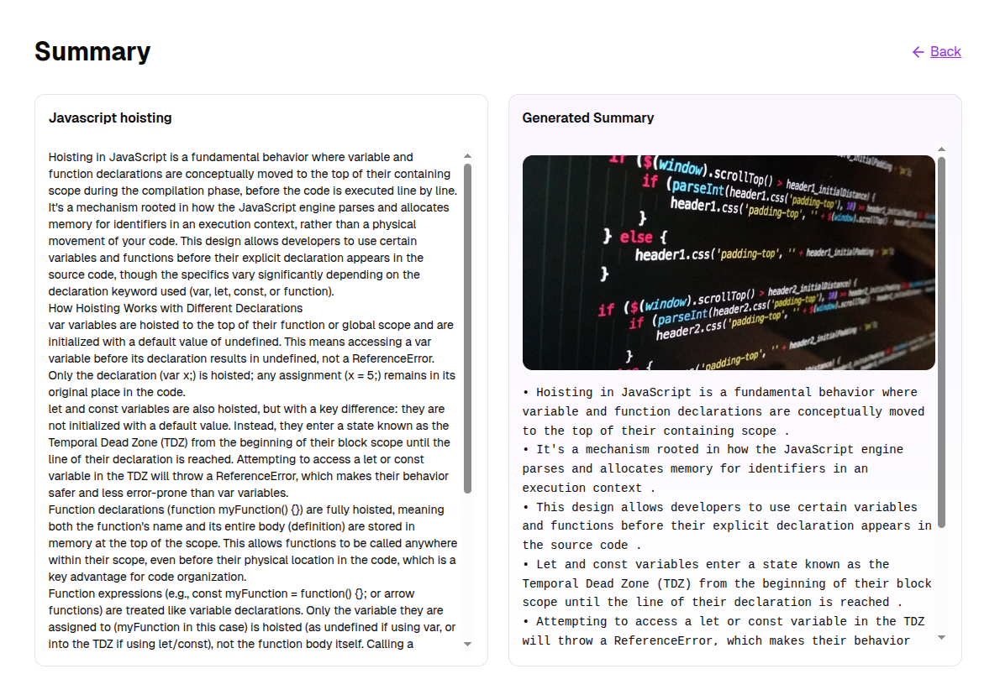
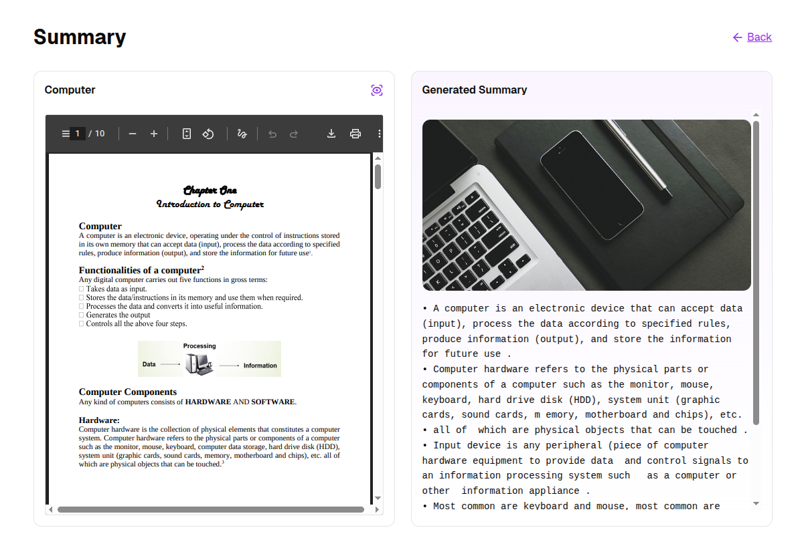

<h1 align="center" style="border-bottom: none">
  
  <br />
  Reviselyt
</h1>

<p align="center">
  <b>Reviselyt</b> is a free and open-source learning tool that helps students and developers turn long PDFs and notes into concise, revision-ready bullet points using open-source AI models. Built with Next.js, Supabase, and AI APIs, it is designed for faster learning, exam preparation, interview revision, and everyday knowledge refresh
</p>

<p align="center">
  ⭐ If you find this project useful, please consider starring the repository.
</p>

<hr/>

<h2>How It Works</h2>

<ol>
    <li>Upload PDF files or paste plain text</li>
    <li>AI generates 5–10 concise bullet points</li>
    <li>Powered by open-source transformer models</li>
    <li>Summaries are saved for future revision</li>
    <li>Daily free usage limits (Free Tier)</li>
    <li>Clean and distraction-free user interface</li>
  <li>Secure authentication and document storage</li>
</ol>

<p><i>⏱ Processing may take 10–30 seconds depending on content length.</i></p>

<hr/>

<h2>Key Features</h2>

<h3>Dashboard Management</h3>
<p>
The dashboard gives you a complete overview of all your generated summaries in one place.
You can quickly track your previous documents, check their type (PDF or Text),
and manage them with ease.
</p>

<p>
Each document entry provides quick actions to <b>view</b> the generated summary
or <b>delete</b> it whenever needed. Pagination support ensures smooth navigation
even when you have multiple summaries.
</p>

<p>
At the top of the dashboard, quick action cards allow you to start instantly by
uploading a PDF or generating a summary from plain text.
</p>

<p align="center">
  
</p>

<hr/>

<h3>PDF & Text Upload</h3>
<p>
Reviselyt supports both PDF-based and text-based summarization.
For text summaries, simply provide a title and paste your content.
For PDFs, upload a text-based document, add a title, and submit it for processing.
</p>

<p>
The upload experience is intentionally minimal and distraction-free,
allowing you to generate summaries within seconds without unnecessary steps.
</p>

<p align="center">
  
</p>

<hr/>

<h2>Summary View</h2>
<p>
Once the summary is generated, Reviselyt presents the content in a side-by-side layout.
The original material appears on one side, while the AI-generated bullet summary
is displayed on the other — making revision faster and more effective.
</p>

<h4>Text-based Summary</h4>
<p>
For pasted text, the summary view helps you quickly scan key points
without rereading long paragraphs.
</p>

<p align="center">
  
</p>

<h4>PDF-based Summary</h4>
<p>
For PDF uploads, Reviselyt extracts the text and generates structured bullet points,
allowing you to revise large documents efficiently.
</p>

<p align="center">
  
</p>

<hr/>

<h2>Free Tier Limits</h2>

<table>
  <tr>
    <th align="left">Feature</th>
    <th align="left">Limit</th>
  </tr>
  <tr>
    <td>PDF Summaries</td>
    <td>1 per day</td>
  </tr>
  <tr>
    <td>Text Summaries</td>
    <td>2 per day</td>
  </tr>
</table>

<p>Limits reset automatically every day.</p>

<hr/>

<h2>Tech Stack</h2>

<ul>
  <li>Next.js (App Router)</li>
  <li>TypeScript</li>
  <li>Tailwind CSS</li>
  <li>Supabase (Authentication & Database)</li>
  <li>Hugging Face (AI models)</li>
  <li>Pixabay API (Visual assets)</li>
</ul>

<hr/>

<h2>Open Source</h2>
<p>
Reviselyt is built in public and open source.
<br /> Issues, feature requests, and pull requests are welcome.
</p>

<ul>
  <li>Powered by open-source transformer models</li>
  <li>AI-powered summaries using public models</li>
  <li>No user data is sold or tracked</li>
  <li>Content is processed only to generate summaries</li>
</ul>


<hr/>

<hr/>

<h2>Local Development Setup</h2>

<h3>1. Clone the repository</h3>

<pre><code>git clone https://github.com/tanushree-coder-girl/reviselyt.git
cd reviselyt</code></pre>

<h3>2. Install dependencies</h3>

<pre><code>npm install
# or
yarn install</code></pre>

<h3>3. Supabase Setup</h3>
<p> Reviselyt uses Supabase for authentication, database storage, and file uploads.
<br />To run the project locally, you must configure your own Supabase project.
</p>
<ul>
<li>Create a Supabase project: Go to: https://supabase.com
</li>
<li>Create a new project
</li>
<li>Database setup :
Run the schema file provided in the repository
in the Supabase SQL Editor (required step).
<br />
This will manually create all required tables,
RLS policies, and triggers. <code>lib/supabase/schema.sql
</code>
</li>
<li>This will create: <code>documents</code>
<code>summaries</code>
<code>summary_cache
</code>
<code>usage_limits</code>
<code>Row Level Security (RLS) policies
</code>
<code>Auto-creation of usage limits for new users</code>
</li>
</ul>

<h3>4. Storage bucket setup (Required for PDF uploads)</h3>

<p>PDF uploads require a Supabase Storage bucket.
</p>

<ul>
<li>Go to Supabase Dashboard → Storage
</li>
<li>Create a new bucket: Name: documents
</li>
</ul>


#### Storage RLS policies (IMPORTANT)

Run the following SQL to allow authenticated users to upload and access files:

```bash
# Allow authenticated users to upload files

create policy "Allow authenticated uploads"
on storage.objects
for insert
to authenticated
with check (
  bucket_id = 'documents'
);
```
```bash
# Allow authenticated users to read files

create policy "Allow authenticated reads"
on storage.objects
for select
to authenticated
using (
  bucket_id = 'documents'
);
```
```bash
# Allow authenticated users to delete files

create policy "Allow authenticated deletes"
on storage.objects
for delete
to authenticated
using (
  bucket_id = 'documents'
);

```

<h3>5. Environment Variables</h3>

Create a .env.local file using the example below.
```bash
cp .env.example .env.local
```

Fill in your own values.

```bash
NEXT_PUBLIC_SUPABASE_URL=
NEXT_PUBLIC_SUPABASE_PUBLISHABLE_KEY=
HF_API_TOKEN=
PIXABAY_API_KEY=
```

<h3>6. Run locally</h3>

<pre><code>npm run dev</code></pre>

<p>Visit <code>http://localhost:3000</code></p>

<hr/>

<h2>Contributing</h2>

<p>
Contributions are welcome!  
Please check <a href="./CONTRIBUTING.md">CONTRIBUTING.md</a> for guidelines before getting started.
</p>

<hr/>

<h2>License</h2>
<p>
Licensed under the <b>GNU Affero General Public License v3.0 (AGPL-3.0)</b>.
</p>

See the [LICENSE](./LICENSE) file for full details.
